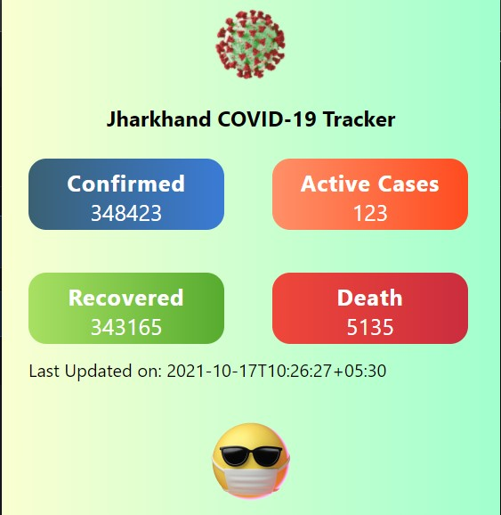

# COVID-19 case tracker (Google Chrome Extension)
It is a google chrome extension that tracks the COVID cases. It shows you the *Total confirm cases, Active cases, Death Cases, Recovered Cases*.
<br/><br>

# Deployment
- Download the project and extract the project to any of your prefered location.
- Locate to the chrome extension manager or search following in the chrome search bar.
```
chrome://extensions
```


- Turn on the Developer Mode and Click on **Load Unpacked**.
- Locate to the project folder that contains the manifest.json file and click on select folder.
- All Done.

## To use the extension


- Go to the extension panel and click on **COVID TRACKER** Extension.

<br/><br/>

# 🛠 Skills Used
### Javascript, HTML, CSS
<br/><br/>

# API used
https://corona.lmao.ninja
<br/><br/>

# Screenshot

<br/><br/>
# Author 
**DEEPAK AGARWAL** <br/><br/>

<br/><br/>
[](https://github.com/deepaksanwaria/)
[](https://www.linkedin.com/in/deepak-agarwal-2460831a9/)
